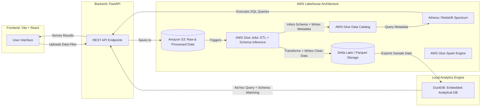

An intelligent, data-intensive application solution for data column mapping and ETL validation, specifically designed for healthcare data integration.

“The intelligent schema-to-pipeline generator — the fastest way to onboard and standardize client data into Data Warehouse of choice.”

“You upload data; we detect schemas, align fields, and *generate* the pipeline for you.”

Created by **Diana Valladares**



---

## Project Overview

**CrosswalkAI** is an **Agentic Data Engineering Tool** that provides an intelligent solution for **data column mapping and ETL (Extract, Transform, Load) validation**. The system helps data engineers map source data columns to standardized target schemas. It includes auto-schema detection, predicting transformations, and building the ETL end-to-end. 

Great for Snowflake, dbt, Airflow. 

### Key Components

---

### Core Problem Solved

The project addresses the complex challenge of **data schema mapping** - taking raw data files from various sources (clients) and mapping their columns to a standardized data model. This is critical in healthcare data engineering where data must conform to specific standards.

---

## Architecture & Technology Stack

### Backend (Python/FastAPI)

- **Framework**: FastAPI with async/await support
- **Database**: DuckDB for data storage and analysis
- **AI/ML Components**:
    - Fuzzy string matching (fuzzywuzzy)
    - TF-IDF vectorization for semantic similarity
    - Pattern recognition for data type inference
    - Self-learning capabilities from user corrections

### Frontend (React/TypeScript)

- **Framework**: React 18 with TypeScript
- **Build Tool**: Vite
- **Styling**: Tailwind CSS
- **UI Components**: Custom components with table/card views
- **Navigation**: React Router for SPA functionality

### Database Schema

The system maintains 14+ database tables including:

- `pi20_data_model` (827+ records) - The active target schema
- `crosswalk_template` (332 records) - Main working crosswalk mappings
- `source_profiles` - Client/project configurations
- `source_columns` - Uploaded source data analysis
- `crosswalk_mappings` - User-defined column mappings

---

## Key Features

### Intelligent Auto-Mapping

**AI-Powered Suggestions**: Hybrid approach combining:

- Fuzzy string matching for column name similarity
- Data pattern analysis for sample values
- Machine learning from user corrections
- Confidence scoring for mapping suggestions

### Interactive Mapping Interface

- **Dual View Modes**: Switch between card-based and table views
- **Real-time Validation**: Immediate feedback on mapping rules
- **Status Tracking**: Visual indicators for mapping completion
    - **Mapped** (Green): Complete mapping with MCDM column
    - **Incomplete** (Red): Needs MCDM column assignment
    - **Custom Field** (Blue): Custom business logic required
    - **Under Review** (Yellow): Requires MCS review
    - **Skipped** (Gray): Intentionally excluded

### Data Model Management

- **PI20 Schema Integration**: Built-in healthcare data model with 827+ standardized fields
- **Schema Layers**: Support for RAW, CLEANSE, and CURATED data layers
- **Field Validation**: Automatic validation against data model rules
- **Custom Field Support**: Define custom fields outside the standard model

### Export & Integration

**Multiple Export Formats**:

- CSV exports for documentation
- JSON configuration files
- SQL scripts for database deployment
- **Snowflake Export**: Specialized integration for Snowflake data warehouse
- **ETL Code Generation**: Automatic generation of data transformation scripts

### File Processing & Analysis

**Automated File Upload**: CSV/Excel file processing

**Data Profiling**: Automatic analysis of:

- Column data types
- Sample values
- Data patterns (phone numbers, dates, IDs, etc.)
- Statistical summaries

### Project Management

- **Multi-Client Support**: Manage mappings for different clients
- **Version Control**: Track different versions and streams (V00, S00, etc.)
- **File Group Organization**: Organize related files by groups
- **Profile Management**: Client-specific configurations and settings

---

## Healthcare Data Specialization

The system includes specialized pattern recognition for healthcare data:

- **Claim Numbers**: Various formats and validation patterns
- **Member IDs**: Healthcare member identification formats
- **NPI Numbers**: National Provider Identifier validation
- **Tax IDs**: Healthcare provider tax identification
- **Medical Codes**: Support for various medical coding systems

---

## AI/Machine Learning Features

### Self-Learning System

- **Correction History**: Tracks user corrections to improve future suggestions
- **Pattern Library**: Builds knowledge base of data patterns
- **Confidence Scoring**: Provides reliability metrics for mapping suggestions
- **Semantic Matching**: Uses TF-IDF and cosine similarity for intelligent column matching

---

## Getting Started

### Prerequisites

- Python 3.9+
- Node.js 16+
- npm or yarn

### Installation

**1. Clone the repository**

```bash
git clone https://github.com/dee-ah-nuh/CrosswalkAI.git
cd CrosswalkAI
```

**2. Backend Setup**

```bash
# Create and activate virtual environment
python -m venv crosswalk
source crosswalk/bin/activate  # On Windows: crosswalk\Scripts\activate

# Install dependencies
cd backend
pip install -r requirements.txt
```

**3. Frontend Setup**

```bash
cd frontend
npm install
```

**4. Database Setup**

```bash
# The DuckDB database will be created automatically
# Initial data is loaded from the business_definitions folder
```

### Running the Application

**Option 1: Using Start Script (Recommended)**

```bash
# From the project root
./start.sh
```

**Option 2: Manual Start**

```bash
# Terminal 1 - Backend
cd backend
uvicorn app:app --reload --port 8000

# Terminal 2 - Frontend
cd frontend
npm run dev
```

The application will be available at:

- **Frontend**: http://localhost:1234
- **Backend API**: http://localhost:8000
- **API Documentation**: http://localhost:8000/docs

---

## 📋 Data Flow Process

1. **Project Setup**: Create client profile and configure project settings
2. **File Upload**: Upload source data files (CSV/Excel)
3. **Auto-Analysis**: System analyzes columns and suggests mappings
4. **Interactive Mapping**: Users review, modify, and approve mappings
5. **Validation**: Real-time validation against business rules
6. **Export**: Generate ETL scripts, documentation, and deployment files

---

## 🏢 Business Value

This tool significantly **reduces the time and effort** required for data engineering projects by:

- **Automating** 60-80% of initial column mapping work
- **Reducing errors** through validation and standardization
- **Enabling faster** project delivery and client onboarding
- **Providing consistency** across different client implementations
- **Learning and improving** from each mapping project

The system is particularly valuable for organizations dealing with **multiple data sources** that need to be integrated into a **standardized data warehouse or analytics platform**.

---

## 📖 API Documentation

The system provides comprehensive API documentation through FastAPI's automatic documentation:

- **Swagger UI**: http://localhost:8000/docs
- **ReDoc**: http://localhost:8000/redoc

### Key API Endpoints

- `GET /api/health` - Health check
- `GET /api/crosswalk/data` - Retrieve crosswalk mappings
- `POST /api/auto-mapping/suggest` - Get AI mapping suggestions
- `GET /api/datamodel/fields` - Data model field listing
- `POST /api/exports/csv` - Export crosswalk as CSV
- `POST /api/snowflake/export` - Generate Snowflake deployment scripts

---

## Development

### Project Structure

```
CrosswalkAI/
├── backend/                 # FastAPI backend
│   ├── app.py              # Main application
│   ├── database/           # Database models and routes
│   ├── datascience/        # AI/ML components
│   └── services/           # Business logic services
├── frontend/               # React frontend
│   ├── src/
│   │   ├── components/     # React components
│   │   ├── services/       # API services
│   │   └── types/          # TypeScript types
├── business_definitions/   # Data model definitions
└── crosswalk/             # Python virtual environment
```

**Backend Services**

- **Auto Mapper**: AI-powered column mapping suggestions
- **Export Service**: Multiple format export capabilities
- **DSL Engine**: Domain-specific language processing
- **File Parser**: CSV/Excel file processing

**Frontend Components**

[**CrosswalkTemplateGrid**: Main mapping interface](https://www.notion.so/CrosswalkTemplateGrid-Main-mapping-interface-28af3f7f2aa0802180afca1f8dd1941a?pvs=21)

[**CrosswalkDetailPanel**: Detailed mapping editor](https://www.notion.so/CrosswalkDetailPanel-Detailed-mapping-editor-28af3f7f2aa080efa6a1d1f3d203eaeb?pvs=21)

[**PI20DataModelGrid**: Data model browser](https://www.notion.so/PI20DataModelGrid-Data-model-browser-28af3f7f2aa080b7be2dcc91f4d6f660?pvs=21)

[**UploadScreen**: File upload interface](https://www.notion.so/UploadScreen-File-upload-interface-28af3f7f2aa080de931ece95f7779007?pvs=21)

[MCS Review Crosswalk: Consultant-side Review Page](https://www.notion.so/MCS-Review-Crosswalk-Consultant-side-Review-Page-28af3f7f2aa080599f57cdc2173c7e51?pvs=21)

---

## Pipeline

[**GitHub Actions CI/CD Pipeline** ](https://www.notion.so/GitHub-Actions-CI-CD-Pipeline-28af3f7f2aa0803e8480ecb95e0a9f56?pvs=21)

- **Dev Branch**: Automated testing and deployment to development environment on every push
- **Release Branch**: Staging deployment with integration tests and approval gates before production
- **Main Branch**: Production deployment with automated builds, tests, and rollback capabilities
- **Automated Checks**: Linting, type checking, unit tests, and security scans on all branches

---

## Logging

The system includes comprehensive logging:

- `backend.log` - Backend application logs
- `frontend.log` - Frontend build and runtime logs
- `CLITS.txt` - Change log and issue tracking

---

## Deployment

### Production Deployment

**1.** Build the frontend:

```bash
cd frontend
npm run build
```

**2.** The backend serves the built frontend automatically from `/frontend/dist`

**3.** Configure environment variables for production database connections

### Shutdown

```bash
# Use the shutdown script
./shutdown.sh

# Or manually stop the processes
```

---

## Contributing

1. Fork the repository
2. Create a feature branch
3. Make your changes
4. Add tests if applicable
5. Submit a pull request

# **How Crosswalk AI is different — the precise gaps you can own**

1. **Arbitrary-source → target star-model mapping as first-class**
    - Competitors handle structured connectors or wrangling; very few accept an arbitrary CSV + a user-supplied *target star schema* and run *semantic* AI matching to populate a model automatically. Crosswalk AI’s core product is *schema reconciliation + mapping suggestions* for business-defined star schemas (fact + dim).
    - Why it matters: reduces human mapping time on client onboarding from days to minutes.
2. **End-to-end artifact generation targeted at Snowflake + dbt + orchestrator**
    - Many tools generate SQL or transformations, but Crosswalk AI produces **Snowflake stored procedures**, **dbt model files**, and **orchestration DAGs (Airflow/Prefect)** automatically from the *same mapping* so teams can choose their governance path (Snowflake-native runs vs dbt-run + Airflow). Coalesce & Prophecy get close for Snowflake/SQL generation, but not with this specific mapping-first UX and multi-artifact output combined.
3. **Human-in-the-loop mapping editor with transformation preview and confidence scoring**
    - Tools like Trifacta and Prophecy provide suggestions/steps, but Crosswalk AI emphasizes **confidence-scored semantic matches**, inline SQL suggestion per column, sample-row preview, and capture of the engineer’s corrections so the system learns mappings over time.
4. **Built-in versioning and deploy options (PR to Git + direct Snowflake deploy + metadata table)**
    - Some products auto-deploy (VaultSpeed, Coalesce), but Crosswalk AI gives **flexible governance**: create PRs, let teams review (dbt + Git), or auto-deploy stored procedures into Snowflake and record versions in a metadata table — tailored to enterprise policies.
5. **Learning mappings across customers (transfer learning)**
    - Crosswalk AI can store mapping patterns and apply them to similar incoming clients (e.g., cust_dob → date_of_birth) improving accuracy. Most competitors are not explicitly marketed for cross-client transfer learning.
6. **Focus on star schema modelling (facts/dimensions) and lookups/joins**
    - VaultSpeed focuses on Data Vault; Coalesce focuses on transforming raw to usable tables; Prophecy is general-purpose. Crosswalk AI’s product messaging can be: **“fastest way to map client data to your canonical star schema and generate production-ready ETL”**.

---

## License

This project is proprietary software created by Diana Valladares.

---

## Support

For support or questions about this project, please contact Diana Valladares.

---

**CrosswalkAI** - Making data integration intelligent and efficient.
